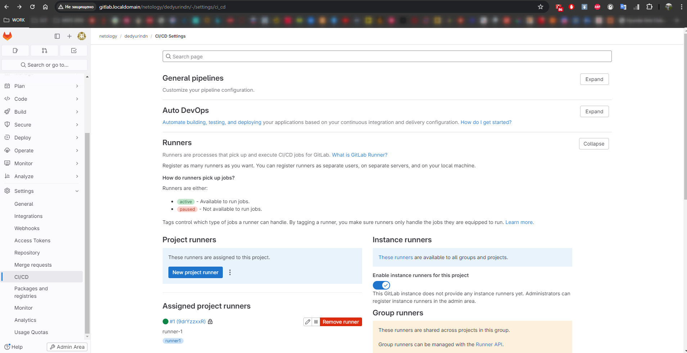
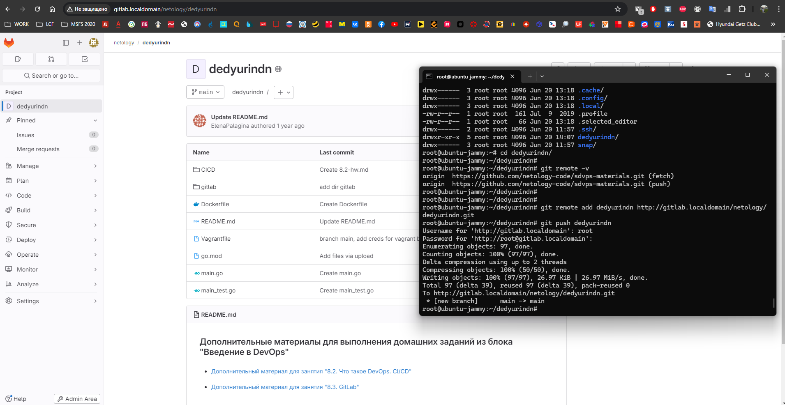
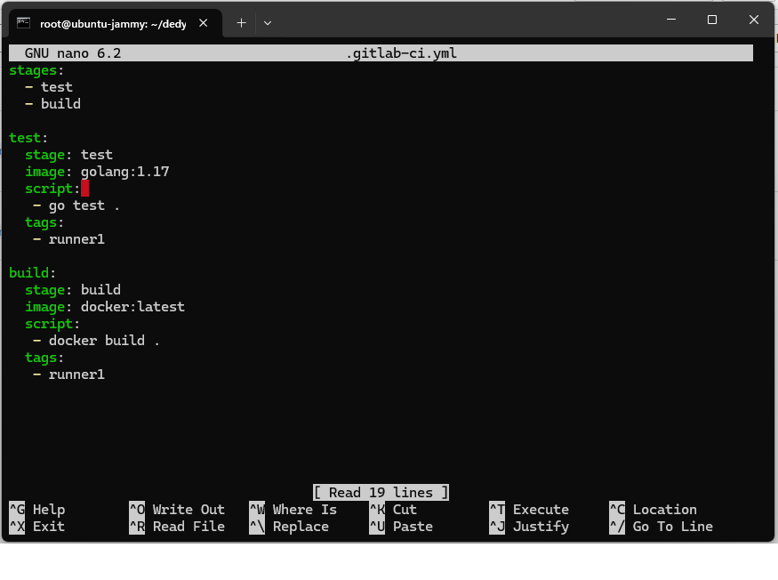
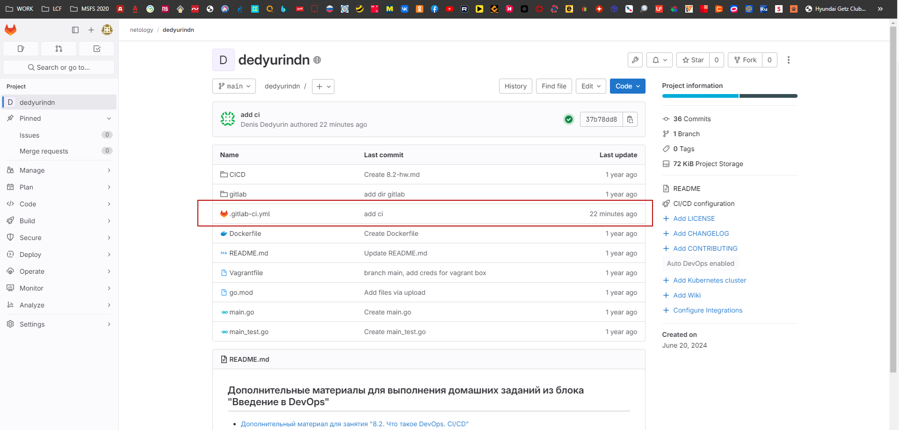
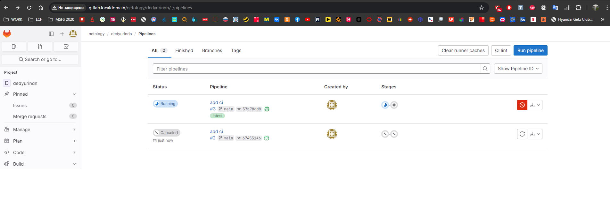
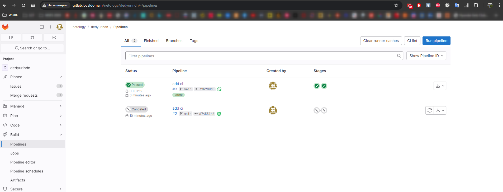

# Домашнее задание к занятию "`GitLab`" - `Дедюрин Денис`

---

## Задание 1
### Устанавливаем ВМ спомощью Vagrant-файла, регистрируем и запускаем Runner:



---

## Задание 2

### Клонируем репозиторий с GitHub и пушим его к себе, в локальный GitLab:



### Команды:
```
git clone https://github.com/netology-code/sdvps-materials.git dedyurind
cd dedyurindn/
git remote -v
git remote add dedyurindn http://gitlab.localdomain/netology/dedyurindn.git
git push dedyurindn
```

### Настраиваем pipeline и запускаем:


### Файл .gitlab-ci.yml



### Результаты сборки:
